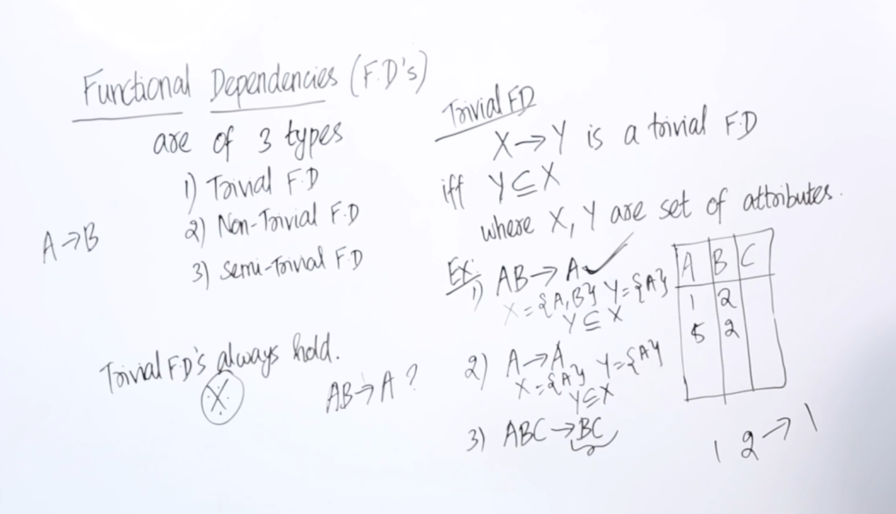

# ERD
https://www.youtube.com/watch?v=-fQ-bRllhXc

# Normalization
https://www.youtube.com/watch?v=GFQaEYEc8_8

# Relational Model

    Every attribute have a domain
    For exmaple look at the following table

    In the above table the attribute sex can have only two vlaues either it can be female or a male.
    Sex ={M,F}
    If the value provided is out of the domain then it will through an error.

# Schema / Entity Type

    If we write the name along with its attribute then it is called schema or entity type. Employe (EmpId,Emp-name,Age,Sex)

    In contrast if we write if we take single record from our table the it is called and entity.
    (100,Sam,30,M)

# Application of Descrete Mathamatics

    In the oabove pic we have two sets a and b and we have their cartsion product so from that we know that c set is subset of axb cause every element of c is present in axb.

    Same is the case for the tables we have domain of EmpId and Sex and we take their cartsion product now if we write out table employee as set we can see that every tuple in the table named employee is subset of EmpId x Sex.

# Degree of a Relation

    Sate of relation is nothing but the current value of the table like if we have two employee the thats te current state.

# Important Rule of Relational Model

- No duplicate should exist in a relation.
- Though domain of an attribute doesnt contain NULL but we still can use it.

# Constraints In Relational Model

    Domain Constraint
        An attribute can only take vlaue from its domain.Except in case of ull.

        With in each tuple, the vlaue of each tuple must be atomic.
    We should not use multivalued and composite attributes. If we have to use it we should convert it into some other form.

        We should convert the EName with the following attributes in case of relational model.

# Super key

    Any superset of a super key is a super key.
    If we take all of the attributes in our table then we can make a super key out of them for example (EmpId,Name,Age,Sex) this is a super key cause it uniquely specify a set of tuple.

    Rule of thumb to check if the attribute is  a super key or not is to check wether the vlaues in the attributes are repating or not if not then it is a super key other wise it is not a super key.

# Key

    It is the minimal set of attributes which uniquely identify a tuple in a relation. It is also known as minimal super key.

    In order to check if a super key in minimal super key or not we can just by delting one the attribuets to see if its is super key or not if yes then it is not a minmal super key.

    for exmaple
        a1,a2
        if we delete the a2 now still a1 is a super key it is not a minmal super key

# Candiadate Key

    There is no much differnce between candidate key and super key there is a small differecne between both having more than one key we can refer to them as candiates key. In the above line we can also call key as minimal super key.

# Entity Integerity Constraint

# Forigen Key

    There can be multiple forigen key in a table a forigen key can contain NULL value.

# Different Domain Constraints

# Normilization

# First Normal Form

    If the table is flat and does not have composite and multivalued attributes then we say that relation is in 1st Normal Form.

    In the third table we dived the table in to two parts first with a and b cause we dont have problme with a and b in this table we have a as primary key.

    In the second table we have A and C as a primary key cause we want lossess less decompostion and A and C are acting as a forigen key to the Table 1.

# Functional Dependecy

    For given value of A I should be able to find uniue value of the B. Thtats mean B is functionally dependednt on A.

    We can tell if they are depenedent on euach other or not If we have disctinct and no duplicate values on the left hand side.
    Then left hande employees any right hand side wll always hold.

    The only way I can say that A does not employee B If i am able to find two value of B for a particular value of A.

# Types of Functional Dependecy

    If Y is a subset of X then it is called a trival functional depenedcy and we can say that X->Y (X employees Y) or Y is functionally depenent on X cause for every value of X I have a uniue value of B.

# Second Normal Form

    In second forma when can say that if part of key drives a an attrubtes or some no prime key attribuets is depedent on the part of the primary key and not the whole prmray key or the key then we can say that the relation is not in the 2nd normal form.

    In the context of database management systems (DBMS), partial dependency refers to a situation in which a non-key attribute (a column) is functionally dependent on only a part of the primary key, rather than the entire key. It means that a non-key attribute depends on only a subset of the primary key, rather than the entire primary key.

CustomerOrders:

OrderID (Primary Key)
CustomerName
CustomerAddress
ProductID
ProductName
Quantity

To convert the "CustomerOrders" table into 2NF, you need to identify the partial dependency and split the table into two separate tables. Here's the solution:

Table: Orders
| OrderID (Primary Key) | CustomerName | CustomerAddress |
|-----------------------|--------------|-----------------|
| 1 | John | Address 1 |
| 2 | Lisa | Address 2 |
| 3 | Mark | Address 3 |

Table: OrderDetails
| OrderID (Foreign Key) | ProductID | ProductName | Quantity |
|-----------------------|-----------|-------------|----------|
| 1 | 101 | Product A | 5 |
| 1 | 102 | Product B | 3 |
| 2 | 101 | Product A | 2 |
| 3 | 103 | Product C | 1 |

In the modified structure, the "Orders" table contains the OrderID (primary key), CustomerName, and CustomerAddress columns. The "OrderDetails" table includes the OrderID (foreign key), ProductID, ProductName, and Quantity columns.

By splitting the original table into two tables, we have eliminated the partial dependency between the OrderID and the CustomerName/CustomerAddress attributes. The OrderDetails table now properly represents the relationship between orders and their associated product details.

Feel free to ask for further explanations or the solution for the remaining examples if needed.

# Third Normal Form

# BCNF

    IN bcnf transitive dependency should not exist which means the left side of all the functional dependecy should have candiate key or super key or It can have prime attributes on its right hand side.

    All of the functional dependecy should rely con candidate key.

    LHS of each functional dependecy should be a candidate key or super key.

